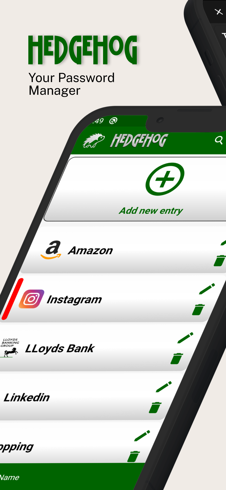
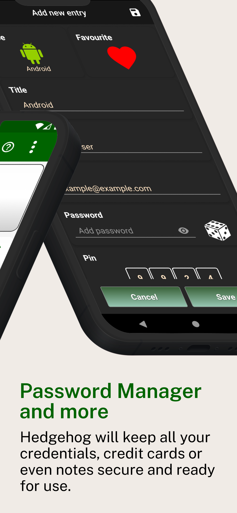

# 🦔 Hedgehog Password Manager

  
  

## 🔐 Store Personal Info  
Hedgehog will keep all your credentials, credit cards or even notes secure and ready for use.

## 🧠 Master Password
The only password you'll need to remember. It will be encrypted upon creation and will be part of the key that encrypts your data.

## 🔒 AES‑256 Encryption
All your data will be stored encrypted locally on your device. We use the world's most advanced encryption algorithm, which would take billions of years to break using current computing technology.

## 🛡️ Two-Factor Encryption (2FE) Key
The key that encrypts your data will be created by two independent pieces of code, providing extra protection for your data: your Master Password and a uniquely generated security code.

## 🕵️ Zero-Knowledge System
Hedgehog is based on a Zero-Knowledge system which means that we know nothing about the data you store on your mobile or on our server.

## ☁️ Save, Restore or Sync
Save, Restore or Sync your data between your Android device and our Google Firebase server. Please note that Hedgehog is using a Two-Factor Encryption (2FE) key which means that your data will travel encrypted and completely unreadable.

## 📴 Offline Functionality 
Hedgehog can be used without network connectivity (including Wi-Fi). Of course, you will need an internet connection during the Save\Restore\Sync operation.

---
> Built for privacy. Designed for simplicity. Powered by trust.
